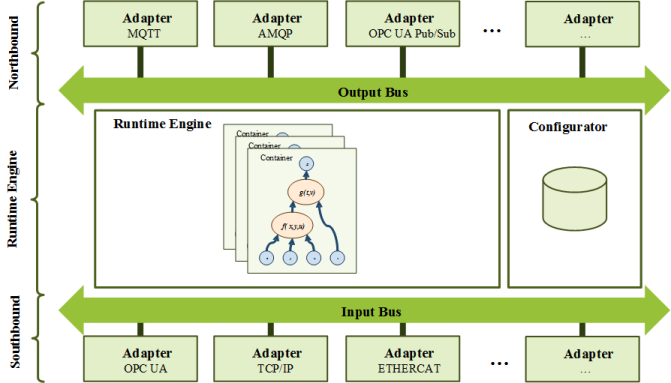

# OPEN-ACCESS (Framework for Edge)

**OPEN-ACCESS** is an open source system extending containerized application orchestration and device management to hosts at the Edge. It is built upon NodeJS and provides core infrastructure support for application deployment and datastzream synchronization between cloud and edge. It also supports multiple communation protocols (AMQP, MQTT, OPCUA, OPCUA pub/Sub, S7-Online, LCOM, ModBus-TCP, Mindsphere-Conect, etc...) and allows developers to author custom logic and enable resource constrained device communication at the Edge.


## Introduction

{: .shadow}
***Fig. 1:*** *Architecture of a runtime engine.* The southbound modules are
responsible for raw data acquisition from external systems and the data
collected are published to the input bus. From there the collected data are
processed by containers that encapsulate a data analytics algorithm in the
form of a digital acyclic graph. The containers are orchestrated and monitored
by the runtime engine and the computation results are published to the
output bus. The nothbound modules are responsible for the transmission of
the computation results to an external system. The configurator stores and
manages the configuration data of all elements of the runtime engine. A more detailed description of the architecture of OPEN-ACCESS is provided in the corresponding [paper](#citation).

As illustrated in Fig. 1, OPEN-ACESS is modularly implemented using NodeJs (Javascript) and is composed of the following components:
  
### Southbound Module

The ***southbound module*** is responsible for raw data acquisition
from external systems including other instances of
OPEN-ACCESS. It is a collection of submodules called
southbound adapter. Each southbound adapter implements a
communication protocol and thus ensures the integration of
heterogeneous systems. An adapter can be configured as a
client to actively read, poll or monitor a data point from any
of the connected systems or as a server to receive published
data. Presented like this, each adapter instance represents a data stream. All data streams are integrated by the input bus, which the runtime engine can access.
  
### Runtime Engine
The ***runtime engine*** is responsible for the execution of
the data analytics algorithms defined in containers. Each
container is assigned a priority, a computation cycle time and
a maximum execution time. A container represents a Digital
Acyclic Graph (DAG), where the leaves of the graph define the
raw data, the node of the graph the operations and the nodes
with no parents the computation results. Each node can be
modeled explicitly using a mathematical function or implicitly
using a neuronal network for example. The runtime engine
schedules, executes and monitors the different containers,
suspending those containers, whose execution behavior differs
from its definition (e. g. execution time longer than expected).
Decoupling the containers also ensures that redundancy and
replication mechanisms for critical algorithms can be implemented.

### Northbound Module

The ***northbound module*** is responsible for the communication
of the computation results with an overlying system, e.g.
the cloud and/or other instances of the runtime engine. It is
also a collection of protocol adapters that can be configured
as client or server.

### Configurator

The ***configurator*** implements an OPC UA server and plays
the role of the knowledge aggregation server, which augments
the computation results with contextual information, e.g. the
multi-domain engineering information model representing the
production system’s architecture. It also manages the configurations
of the runtime engine and offers an interface to
manipulate the configuration of the algorithms, allowing an
online fine-tuning.

## Installation Requirements


* NodeJs : The Backend requires NodeJs and a node global package npm.
* Git
* Dockers: For a container installation, Docker is required. Please refer to the docker documentation for docker installation.

## Installation


### NodeJS

Step 1: Clone this repo.

```bash
git clone https://github.com/jupiterbak/OPEN-ACCESS.git
cd OPEN-ACCESS
```

Step 2: Install the dependencies.

```bash
npm install
```

Step 2: Start the application. Run the following

```bash
npm start
```

After a sucessfull startup the following output should be printed. Please notice the information that all modules have been sucessfully initialized and started.

```

C:\GitHub\OPEN-ACCESS>npm start

> open_access@0.0.1 start C:\GitHub\OPEN-ACCESS
> node open_access.js

4 Dec 18:40:24 - [info] Engine initialized successfully!
4 Dec 18:40:24 - [info] Config API initialized successfully.
4 Dec 18:40:24 - [info] Configurator initialized successfully.
OPEN_ACCESS initialized successfully.
4 Dec 18:40:24 - [info] Northbound[dummyNorthBound] started successfully!
4 Dec 18:40:24 - [info] Southbound[dummySouthbound] started successfully!


===============================
OPEN ACCESS engine.welcome
===============================

4 Dec 18:40:24 - [info] runtime.version OPEN ACCESS :0.0.1
4 Dec 18:40:24 - [info] runtime.version Node JSv8.11.1
4 Dec 18:40:24 - [info] Windows_NT 6.1.7601 x64 LE
4 Dec 18:40:24 - [info] Engine started successfully.
4 Dec 18:40:24 - [info] Config API started successfully.
4 Dec 18:40:24 - [info] Configurator started successfully.
OPEN_ACCESS start successfully.
4 Dec 18:40:24 - [info] Config API is listening on port 55554 (http://localhost:55554/api/v1)
4 Dec 18:40:24 - [info] Config API Swagger-Ui is available on http://localhost:55554/api-docs

```

The OPEN ACCESS Rest API is now accessible at [http://localhost:55554](http://localhost:55554). And the Documentation at [http://localhost:55554/docs](http://localhost:55554/docs)

## Deploy as a Microservice using Docker[Swarm]

You can also deploy OPEN-ACCESS as a microservice inside a Docker container:

Step 1: Clone the repo

```bash
git clone https://github.com/jupiterbak/OPEN-ACCESS.git
cd OPEN-ACCESS
```

Step 2: Build the Docker image

```bash
docker build -t open_access .
```

Step 3: Run the Docker container locally:

```bash
docker run -p 55554:55554 -d open_access
```

Step 3_a: Run the Docker container in the cluster:

```bash
sudo docker-compose build
```

```bash
docker stack deploy --compose-file swarm_deploy.yml OPEN_ACCESS_STACK
```

<!-- CITATION -->

## Citation

If you use this code for your research, please cite our paper

```

@INPROCEEDINGS{8607483,
    author={J. {Bakakeu} and J. {Fuchs} and T. {Javied} and M. {Brossog} and J. {Franke} and H. {Klos} and W. {Eberlein} and S. {Tolksdorf} and J. {Peschke} and L. {Jahn}},
    booktitle={2018 IEEE International Conference on Industrial Engineering and Engineering Management (IEEM)},
    title={Multi-Objective Design Space Exploration for the Integration of Advanced Analytics in Cyber-Physical Production Systems},
    year={2018},
    volume={},
    number={},
    pages={1866-1873},
    doi={10.1109/IEEM.2018.8607483},
    ISSN={2157-3611},
    month={Dec},
}

```

<!-- CONTRIBUTING -->
## Contributing

Any contributions you make are **greatly appreciated**.

1. Fork the Project
2. Create your Feature Branch (`git checkout -b feature/AmazingFeature`)
3. Commit your Changes (`git commit -m 'Add some AmazingFeature'`)
4. Push to the Branch (`git push origin feature/AmazingFeature`)
5. Open a Pull Request

<!-- LICENSE -->
## License

Distributed under the MIT License. See `LICENSE` for more information.

<!-- CONTACT -->
## Contact

Jupiter Bakakeu - [@JBakakeu](https://twitter.com/JBakakeu) - jupiter.bakakeu@gmail.com

Project Link: [https://github.com/jupiterbak/FAPS_DEMONSTRATOR](https://github.com/jupiterbak/FAPS_DEMONSTRATOR)
